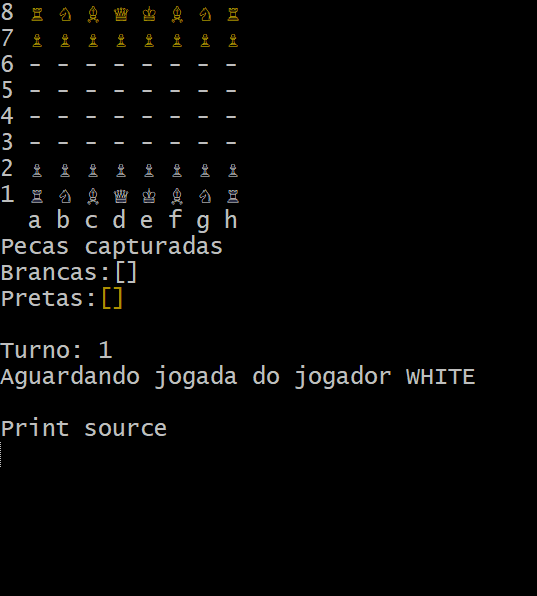

##  Visão Geral do Projeto

- **Linguagem & Plataforma:** Java 17+ (Execução via Terminal / CLI).
- **Arquitetura:** Separação estrita em camadas (`boardgame`, `chess`, `application`).
- **Recursos Suportados:**
  - ♟️ Movimentação e captura de todas as 6 peças.
  - 🔄 Controle de turnos e detecção automática de **Xeque** e **Xeque-mate**.
  - ⚡ Jogadas especiais: **Roque** (Pequeno e Grande), **En Passant** e **Promoção**.
  - 🎨 Interface CLI com caracteres Unicode, suporte a cores ANSI e destaque de movimentos válidos.
- **Tratamento Defensivo:** Exceções personalizadas (`ChessException`, `BoardException`) para controle de estados inválidos.
 ---
## Status do Projeto

- **Motor Lógico:** 100% Concluído e Validado.
- **Interface CLI:** Concluída com suporte a caracteres Unicode e cores ANSI.
- **Próximos Passos (Evolução de Portfólio):** Exposição das regras de negócio através de uma API REST com **Spring Boot**, conexão com uma interface web moderna e conexão a um Banco de Dados.


<h2 align="center">Demonstração em Tempo Real</h2>

<p align="center">
  
</p>

<p align="center">
  <i>Execução do jogo via CLI com caracteres Unicode e cores ANSI.</i>
</p>

--- 
##  Como Executar
1. Clone o repositório.
2. Compile os arquivos Java.
3. Execute no terminal:
```bash
java -Dfile.encoding=UTF-8 -cp bin application.Program
```
--- 
## Contexto do Desenvolvimento
Este projeto foi desenvolvido como parte prática do curso de formação em **Java e Programação Orientada a Objetos** ministrado pelo Prof. Nelio Alves, com o objetivo de consolidar conceitos avançados de engenharia de software e arquitetura de código.

Embora baseado em uma estrutura guiada, a implementação exigiu alto nível de análise lógica e autonomia técnica, englobando:

- **Resolução Autônoma de Bugs Complexos:** Identificação e correção de problemas de acoplamento, ordenação de parâmetros em construtores de coordenadas e mapeamento de eixos matriz-tabuleiro.
- **Domínio da Lógica de Negócio:** Mapeamento completo dos estados do jogo (Xeque, Xeque-mate, turnos e regras de movimentação das 6 peças).
- **Validação e Programação Defensiva:** Implementação de exceções personalizadas para impedir jogadas inválidas e garantir a integridade da partida.

---

## Engenharia de Software e Boas Práticas

A arquitetura do projeto foi estruturada visando o desacoplamento de responsabilidades e a legibilidade do código:

- **Arquitetura em Camadas:** Separação estrita entre a camada de domínio/regras do xadrez (`chess`), o motor genérico do tabuleiro (`boardgame`) e a camada de apresentação no terminal (`application`).
- **Paradigma Orientado a Objetos:** Uso ostensivo de **Polimorfismo** e **Herança** para representação das peças, **Encapsulamento** para proteção do estado do tabuleiro e **Classes Abstratas**.
- **Refatoração e Performance:** Otimização de algoritmos de movimentação de peças (como Rei e Cavalo) utilizando vetores de deslocamento (*offsets*), reduzindo redundâncias de código.
- **Internacionalização e Padronização:** Atributos e métodos nomeados em inglês seguindo convenções globais de código limpo (*Clean Code*).

---
